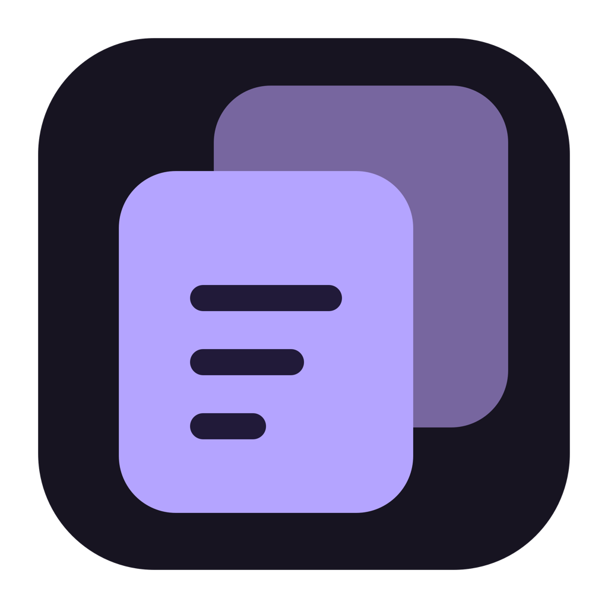

<p align="center"></p>
<h1 align="center">Snippet</h1>
<p align="center">The text you need, one hotkey away.</p>
<p align="center"><a href="https://github.com/swlittles/Snippet/actions/workflows/ci.yml"></a> · macOS 13+ · SwiftUI + AppKit · MIT</p>

Snippet is a native Mac menu-bar app for finding copied text, reusing saved snippets, and doing quick calculations without leaving your keyboard. Press **Option–Space**, search, then **Return** to paste into the app you were using.

No account. No cloud service. No analytics. Your library stays on your Mac.

## Why it exists

You copy a link, copy something else, and lose the link. You type the same reply every day. You interrupt your work to find an address or do a quick calculation. Snippet gives those small, repeated tasks one home.

| Problem | What Snippet does |
| --- | --- |
| The clipboard only remembers your latest copy | Search a local history of copied plain text |
| Useful text disappears after cleanup | Star favorites to keep them indefinitely |
| Repeated replies, addresses, or commands take time to retype | Save named snippets with tags and optional `;keywords` |
| A copied clip needs a correction before reuse | Edit clips and snippets directly with Cmd–E |
| Switching tools interrupts your flow | Open a hotkey panel, paste, and return to your previous app |
| You need a calculation you made earlier | Use the calculator and its persistent history |

Inspired by Alfred’s keyboard-first workflow; an independent project, not affiliated with Alfred. Snippet focuses on clipboard text, snippets, and calculations. It is not a general application launcher or workflow automation engine.

## Download and install

Visit **[GitHub Releases](https://github.com/swlittles/Snippet/releases)** for release status and downloads. Stable releases are built for **Apple Silicon and Intel** in a single universal app, signed with Developer ID, and notarized by Apple.

The stable release pipeline refuses to publish without successful signing and notarization. Use the DMG or ZIP attached to a stable release; source archives and builds labelled “developer preview” are not notarized app downloads.

For a stable release:

1. Download the `Snippet-…-macos-universal.dmg` asset.
2. Open it and drag **Snippet** into **Applications**.
3. Launch Snippet from Applications. Its icon appears in the menu bar.
4. Enable clipboard history in Settings if you want to remember copies.
5. Enable Snippet in **System Settings → Privacy & Security → Accessibility** for direct paste and optional keyword expansion.

A ZIP and SHA-256 checksums accompany each release. See [installation, updates, and troubleshooting](docs/INSTALL.md). Updates are manual; there is no automatic updater yet.

## Use it

| Default shortcut | Action |
| --- | --- |
| Option–Space | Open or close Snippet |
| Cmd–1 / Cmd–2 / Cmd–3 | Clipboard / Snippets / Calculator |
| Tab / Shift–Tab | Next / previous result, wrapping |
| Return | Paste the selected result |
| Cmd–Return | Copy the selected result |
| Cmd–N | Create a snippet |
| Cmd–S | Save a clip as a snippet; save changes inside an editor |
| Cmd–E | Edit the selected clip or snippet |
| Cmd–Shift–F | Toggle favorite |
| Control–Tab / Control–Shift–Tab | Cycle sections |
| Cmd–comma | Settings |

Click a row’s **star** to favorite it or its **pencil** to edit. The star beside the section tabs filters to favorites. Favorites sort first and survive retention cleanup. Every keyboard command can be changed in **Settings → Shortcuts**.

The calculator supports parentheses, scientific functions, powers, factorials, percentages, RAD/DEG modes, and `ans`. Appearance settings include five themes and custom native color pickers.

Read the [full user guide](docs/USER_GUIDE.md) for keyword expansion, calculator syntax, and settings.

## Your data

- Capture and keyword expansion start **off**.
- Ordinary clips expire after seven days, with a maximum of 500. **Favorite clips are exempt from both limits.**
- Clearing clipboard history keeps favorites and snippets. Individual removal deletes the selected clip.
- Snippets remain until you delete them; the calculator remembers its latest 200 entries.
- Data is stored as local JSON with owner-only file permissions. It is not encrypted by Snippet.
- Known password apps and concealed/transient clipboard types are filtered, but this cannot detect every sensitive value. Snippet is not a password manager.

Read [Privacy](PRIVACY.md) for storage locations, permissions, and deletion behavior.

## Build from source

Install Xcode or Apple’s Command Line Tools with Swift 5.9 or newer, then:

```sh
git clone https://github.com/swlittles/Snippet.git
cd Snippet
bash scripts/test.sh
bash scripts/build.sh
open dist/Snippet.app
```

Quit the app before replacing its installed build. Local builds are ad-hoc signed by default; their Accessibility grant may need refreshing after code changes. The build script refuses to overwrite a running app.

For a universal developer build:

```sh
SNIPPET_UNIVERSAL=1 bash scripts/build.sh
```

There are no third-party runtime dependencies. See [architecture](docs/ARCHITECTURE.md), [contributing](CONTRIBUTING.md), and [release engineering](docs/RELEASING.md).

## Project links

- [Problems and design decisions](docs/DESIGN.md)
- [Changelog](CHANGELOG.md)
- [Report a bug](https://github.com/swlittles/Snippet/issues/new?template=bug_report.md)
- [Security reporting](SECURITY.md)
- [MIT license](LICENSE)
